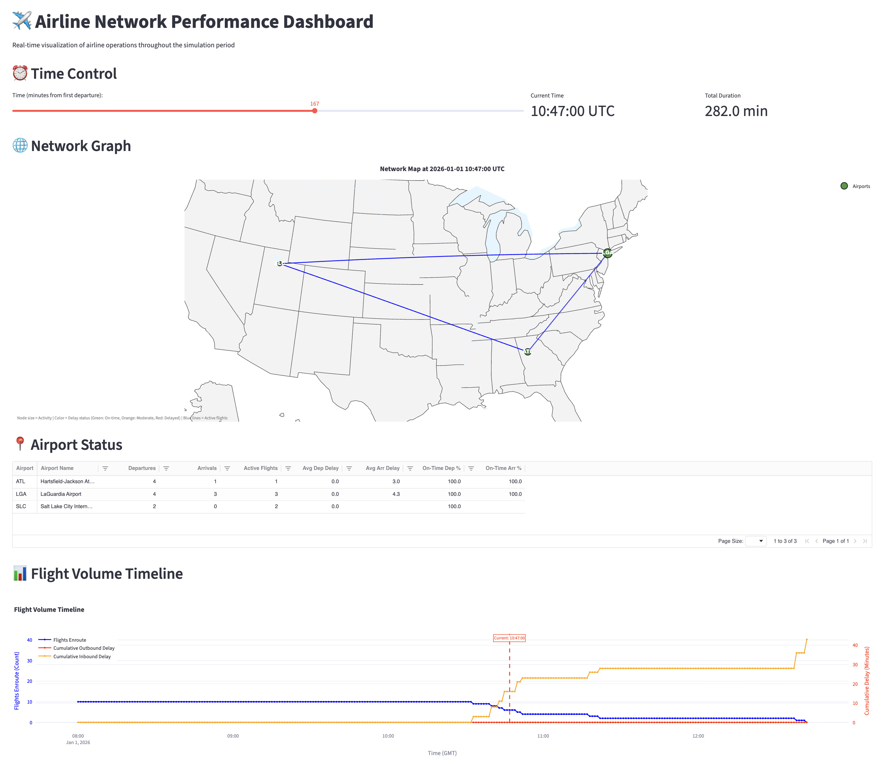

# Airline Graph Database

A graph database implementation for airline and flight data analysis using Python.

## Project Structure

```
airline_graph/
├── agraph_env/          # Virtual environment (excluded from git)
├── config/              # Configuration files
├── data/
│   ├── raw/            # Raw data files
│   └── processed/      # Processed/cleaned data
├── docs/               # Documentation
├── notebooks/          # Jupyter notebooks for exploration
├── scripts/            # Utility scripts
├── src/                # Source code
│   └── airline_graph/  # Main package
├── tests/              # Test files
├── .gitignore          # Git ignore rules
├── requirements.txt    # Python dependencies
└── README.md           # This file
```

## Setup

1. Activate virtual environment:
```bash
source agraph_env/bin/activate  # On macOS/Linux
# or
agraph_env\Scripts\activate     # On Windows
```

2. Install dependencies:
```bash
pip install -r requirements.txt
```

## Usage

### Building the Graph

To build the flight graph from the sample data:

```bash
# Build and save the graph
python scripts/build_graph.py --save data/processed/t1.json
```

This will:
1. Load airport data from `data/raw/airports_sample.csv`
2. Load flight data from `data/raw/flights_sample.csv`
3. Create a NetworkX MultiDiGraph with airports as nodes and flights as edges
4. Generate event-level snapshots for temporal analysis
5. Save the graph to `data/processed/t1.json`

You can also load an existing graph:

```bash
# Load an existing graph
python scripts/build_graph.py --load data/processed/t1.json
```

### Running the Dashboard

To view the interactive Streamlit dashboard:

```bash
# Start the Streamlit server
streamlit run scripts/dashboard.py
```

This will:
1. Load the graph from `data/processed/t1.json` (or build it if not found)
2. Launch a web server (typically at http://localhost:8501)
3. Display an interactive dashboard with:
   - Network graph visualization on a geographic map
   - Airport status table with real-time metrics
   - Flight volume timeline charts
   - Event timeline with all departures and arrivals

#### Dashboard Preview



The dashboard provides:
- **Network Graph**: Geographic visualization of the flight network overlaid on a US map
- **Airport Status**: Sortable and filterable table showing airport metrics (departures, arrivals, delays, on-time percentages)
- **Flight Volume Timeline**: Charts showing flights enroute, cumulative inbound/outbound delays over time
- **Event Timeline**: Chronological log of all departure and arrival events with filtering capabilities

Use the time slider at the top to navigate through the simulation period and see how airport and flight states change over time.

## Documentation

See `docs/` directory for:
- Data definitions (`definitions.md`)
- Graph database recommendations (`graph_database_recommendations.md`)
